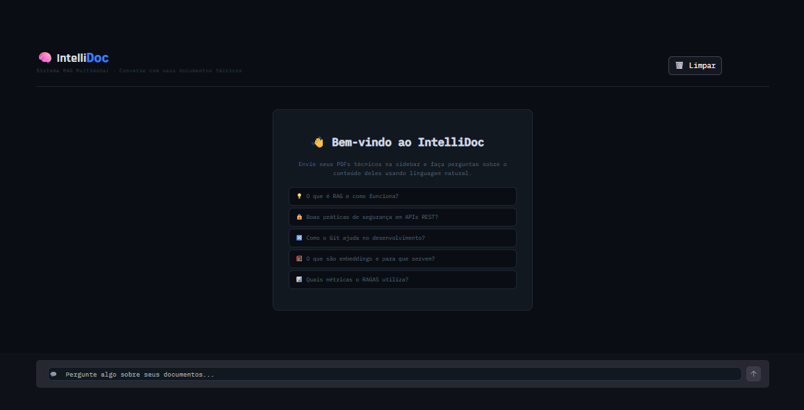

<div align="center">

# 🧠 IntelliDoc RAG Multimodal

**Sistema de Perguntas & Respostas sobre Documentos com IA**

[](https://python.org)
[](https://langchain.com)
[](https://openai.com)
[](https://pinecone.io)
[](https://streamlit.io)
[](https://github.com/tesseract-ocr/tesseract)
[](LICENSE)
[]()

<br/>

> Ingere PDFs técnicos e imagens, transforma em embeddings semânticos, armazena em banco vetorial  
> e responde perguntas com GPT-4o-mini — com avaliação automática de fidelidade para evitar alucinações.

<br/>



</div>

---

## 📌 O que é este projeto?

O **IntelliDoc RAG Multimodal** é um sistema completo de *Retrieval-Augmented Generation* (RAG) que permite fazer perguntas em linguagem natural sobre documentos técnicos — PDFs ou imagens com texto — e receber respostas precisas, fundamentadas e com citação da fonte.

O diferencial está no **pipeline de avaliação automática**: cada resposta é pontuada em métricas de *fidelidade*, *relevância* e *precisão de contexto* usando a biblioteca RAGAS, tornando o sistema auditável e confiável.

> 📖 **Projeto de portfólio em construção** — desenvolvido do zero, passo a passo, com documentação de cada decisão técnica. Acompanhe a evolução pelos [commits](../../commits) e [issues](../../issues).

---

## ✨ Status das Funcionalidades

| Funcionalidade | Descrição | Versão |
|---|---|---|
| 📄 **Ingestão de PDFs** | Extração de texto com metadados via PyMuPDF | ✅ v1.0 |
| 🔪 **Chunking Inteligente** | Divisão com overlap via LangChain TextSplitter | ✅ v1.0 |
| 🔢 **Embeddings Semânticos** | Vetorização com `text-embedding-3-small` | ✅ v1.0 |
| ⚡ **Ingestão Incremental** | Hash MD5 — processa apenas arquivos novos/alterados | ✅ v1.0 |
| 🗄️ **Banco Vetorial** | 65+ vetores no Pinecone, busca semântica | ✅ v1.0 |
| 🔗 **Pipeline RAG** | Busca semântica + GPT-4o-mini integrados | ✅ v1.0 |
| 🛡️ **Respostas Honestas** | Diz quando não encontra a informação | ✅ v1.0 |
| 📊 **Avaliação RAGAS** | 4 métricas automáticas de qualidade | ✅ v1.0 |
| 🌐 **Interface Streamlit** | Upload, chat, gestão de docs e scores RAGAS | ✅ v1.0 |
| 🖼️ **OCR de Imagens** | Extração de texto de imagens via Tesseract 5.5 | ✅ v1.1 |
| 🔗 **OCR no Pipeline** | Imagens indexadas junto com PDFs automaticamente | ✅ v1.1 |
| 🖼️ **Upload de Imagens** | Aceitar imagens na interface Streamlit | 🔄 v1.1 em progresso |
| 💬 **Memória Persistente** | Histórico entre sessões | 🔜 v1.1 |
| 🚀 **Deploy em Nuvem** | Streamlit Cloud ou Hugging Face Spaces | 🔜 v1.1 |

---

## 🏗️ Arquitetura do Sistema

```
┌──────────────────────────────────────────────────────────────────┐
│                     IntelliDoc RAG Multimodal                     │
└──────────────────────────────────────────────────────────────────┘

  📂 INPUT               🔄 PROCESSING             🗄️ STORAGE
  ┌──────────┐          ┌──────────────┐          ┌──────────────┐
  │   PDF    │─PyMuPDF─▶│  Hash MD5    │          │              │
  └──────────┘          │  Chunking    │─Embed───▶│   Pinecone   │
  ┌──────────┐          │  +Metadata   │  (novos) │  65+ vetores │
  │  Imagem  │─Tesseract▶  OCR ✅     │          │              │
  └──────────┘          └──────────────┘          └──────┬───────┘
                                                         │
  💬 QUERY ✅            🤖 GENERATION ✅          🔍 RETRIEVAL ✅
  ┌──────────┐          ┌──────────────┐          ┌──────────────┐
  │ Pergunta │─Embed───▶│ GPT-4o-mini  │◀─Top-K───│    Busca     │
  └──────────┘          │ + Contexto   │          │  Semântica   │
                        └──────┬───────┘          └──────────────┘
                               │
  📊 EVALUATION ✅       📤 OUTPUT ✅
  ┌──────────────┐      ┌──────────────┐
  │    RAGAS     │◀─────│   Resposta   │
  │  Score 0.81  │      │  + Fontes    │
  └──────────────┘      └──────────────┘
```

---

## 📊 Resultados da Avaliação RAGAS

| Métrica | Score | Threshold | Status |
|---|---|---|---|
| **Faithfulness** | 0.9333 | ≥ 0.80 | ✅ |
| **Answer Relevancy** | 0.9334 | ≥ 0.75 | ✅ |
| **Context Precision** | 0.8000 | ≥ 0.70 | ✅ |
| **Context Recall** | 0.5857 | ≥ 0.70 | ⚠️ Melhora com mais docs |
| **Score Médio** | **0.8131** | ≥ 0.75 | ✅ |

---

## 🖼️ Pipeline OCR de Imagens

O módulo `src/ocr.py` extrai texto de imagens usando **Tesseract 5.5** com pré-processamento automático:

```
Imagem original
      ↓
Escala de cinza      → Tesseract funciona melhor sem cores
      ↓
Contraste ×2.0       → Destaca texto do fundo
      ↓
Nitidez ×2.0         → Bordas das letras mais definidas
      ↓
Filtro SHARPEN       → Nitidez adicional
      ↓
Tesseract OCR        → lang="por+eng", psm=3 (automático)
      ↓
Limpeza do texto     → Remove linhas vazias e espaços extras
      ↓
Chunks + Pinecone    → Mesmo pipeline dos PDFs ✅
```

**Formatos suportados:** `.png` `.jpg` `.jpeg` `.bmp` `.tiff` `.webp`

---

## ⚡ Ingestão Incremental

O sistema usa **hash MD5** para detectar mudanças — PDFs e imagens são verificados juntos:

```
1ª execução:                  2ª execução (sem mudanças):
──────────────────────        ────────────────────────────────
🆕 novo  — doc1.pdf           ⏭️  doc1.pdf — sem alterações
🆕 novo  — foto.png           ⏭️  foto.png — sem alterações
→ gera embeddings             → zero chamadas à API OpenAI
→ insere no Pinecone          → Pinecone já está atualizado!
→ salva hashes MD5
```

---

## 🛠️ Stack Tecnológica

| Categoria | Tecnologia | Versão |
|---|---|---|
| Linguagem | Python | 3.11 |
| Interface | Streamlit | 1.55+ |
| Orquestração IA | LangChain | 0.1+ |
| LLM | OpenAI GPT-4o-mini | latest |
| Embeddings | text-embedding-3-small | latest |
| Banco Vetorial | Pinecone (serverless) | 8.1+ |
| Parser PDF | PyMuPDF (fitz) | 1.27+ |
| Chunking | LangChain Text Splitters | 0.1+ |
| Deduplicação | Hash MD5 | built-in |
| OCR Engine | Tesseract | 5.5 ✅ |
| OCR Python | pytesseract + Pillow | 0.3+ ✅ |
| Avaliação | RAGAS | 0.4+ |
| Env vars | python-dotenv | 1.0+ |

---

## 📁 Estrutura do Projeto

```
intellidoc-rag/
│
├── 📄 README.md
├── 📋 requirements.txt
├── 📄 LICENSE
├── 🔒 .env.example
├── 🚫 .gitignore
├── 🔧 fix_ssl.py
│
├── 📂 data/
│   ├── raw/                   # PDFs e imagens originais
│   └── processed/
│       ├── chunks.json
│       ├── controle_ingestao.json
│       └── relatorio_ragas.json
│
├── 📂 docs/
│   └── demo_interface.png
│
└── 📂 src/
    ├── ingest.py          # ✅ Ingestão PDFs + integração OCR
    ├── embeddings.py      # ✅ Embeddings via OpenAI
    ├── vector_store.py    # ✅ Pinecone + ingestão incremental PDFs e imagens
    ├── rag_pipeline.py    # ✅ Pipeline RAG end-to-end
    ├── evaluation.py      # ✅ Avaliação RAGAS
    ├── ocr.py             # ✅ OCR de imagens com Tesseract
    └── app.py             # ✅ Interface Streamlit
```

---

## 🚀 Como Executar

### Pré-requisitos
- Python 3.11
- Tesseract 5.5 instalado ([download](https://github.com/UB-Mannheim/tesseract/wiki))
- Conta OpenAI com API Key e créditos
- Conta Pinecone com API Key

### 1. Clone o repositório

```bash
git clone https://github.com/JosafaSants/IntelliDoc-RAG-Multimodal.git
cd IntelliDoc-RAG-Multimodal
```

### 2. Ambiente virtual

```bash
py -3.11 -m venv venv
venv\Scripts\Activate.ps1    # Windows
source venv/bin/activate      # Mac/Linux
```

### 3. Instale as dependências

```bash
pip install -r requirements.txt
```

### 4. Configure as variáveis de ambiente

```bash
copy .env.example .env
# Edite o .env com suas chaves reais
```

### 5. (Redes corporativas) Corrija o SSL

```bash
python fix_ssl.py
```

### 6. Indexe os documentos e imagens

```bash
# Coloque PDFs e imagens em data/raw/ e execute:
python src/vector_store.py
```

### 7. Inicie a interface

```bash
streamlit run src/app.py
```

---

## 🗺️ Roadmap

- [x] **Fase 1** — Ambiente, Git e API OpenAI ✅
- [x] **Fase 2** — Ingestão multi-PDF com chunking ✅
- [x] **Fase 3** — Embeddings e banco vetorial Pinecone ✅
- [x] **Fase 4** — Pipeline RAG end-to-end ✅
- [x] **Fase 5** — Avaliação RAGAS — score médio 0.81 ✅
- [x] **Fase 6** — Interface Streamlit — v1.0 publicada ✅
- [x] **Fase 7** — OCR de imagens integrado ao pipeline ✅
- [ ] **Fase 7b** — Upload de imagens na interface Streamlit 🔄
- [ ] **Fase 8** — Deploy em nuvem 🔜

---

## 📝 Diário de Desenvolvimento

### ✅ Fase 7 — OCR integrado ao pipeline
- Tesseract 5.5 instalado e configurado no Windows
- `src/ocr.py` criado com pré-processamento automático de imagens
- Integração com `ingest.py` — função `processar_todos_arquivos()` unifica PDFs e imagens
- `vector_store.py` atualizado para detectar e indexar imagens novas/alteradas
- Testado com `teste_ocr.png` → 2 chunks extraídos e enviados ao Pinecone
- Ingestão incremental funcionando para imagens — mesmo comportamento dos PDFs

### ✅ Fase 6 — v1.0 publicada
- Interface Streamlit dark mode com sidebar funcional
- Gestão de documentos: upload, listagem e deleção
- Chat interativo com histórico e citação de fontes
- Release v1.0.0 publicada no GitHub

### ✅ Fases 1–5 — Pipeline completo
- Ambiente, embeddings, Pinecone, RAG e avaliação RAGAS implementados
- Ingestão incremental otimizada com hash MD5

### 🔧 Melhorias identificadas pelo desenvolvedor
- **Ingestão incremental v2** — embeddings gerados apenas para chunks alterados, eliminando desperdício de créditos de API

---

## 🧑‍💻 Sobre o Desenvolvimento

Construído do zero como portfólio de aprendizado em **IA aplicada e Engenharia de Software**. O repositório documenta não apenas o produto final, mas a jornada — com decisões técnicas, problemas encontrados e melhorias propostas pelo próprio desenvolvedor.

---

## 📄 Licença

Distribuído sob a licença MIT. Veja [LICENSE](LICENSE).

---

<div align="center">

Feito com 🧠 e muito café

⭐ Se este projeto te ajudou, deixe uma estrela!

</div>
